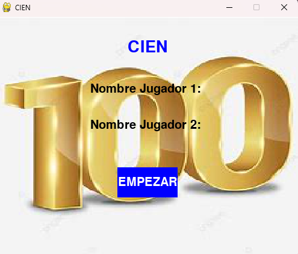
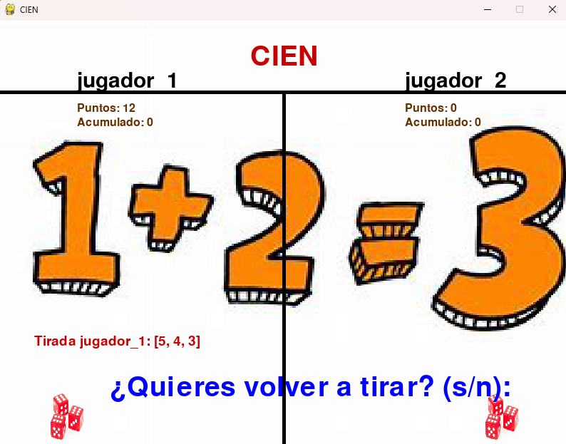
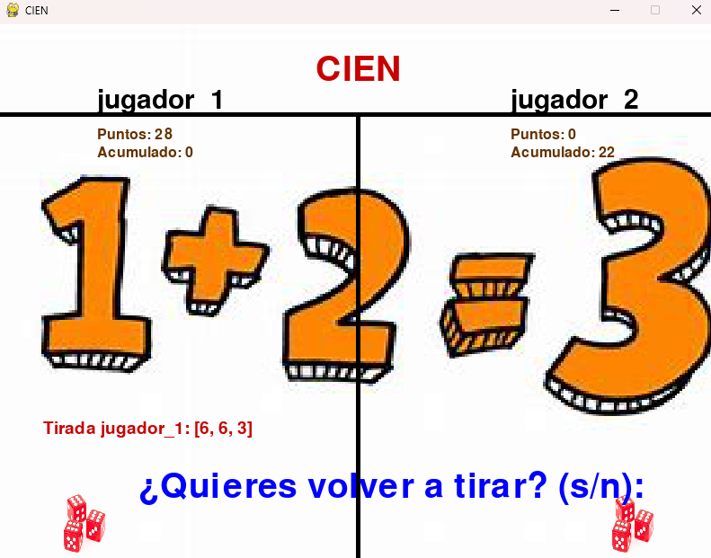

# Juego de CIEN

El juego de CIEN es una emocionante experiencia implementada en Python utilizando la biblioteca Pygame. Este juego recrea la diversión de lanzar dados y acumular puntos mientras compites contra un oponente para alcanzar la meta de 100 puntos primero.

## Imágenes

## Requisitos

- **Python 3.x:** Asegúrate de tener Python instalado. Puedes descargarlo desde [python.org](https://www.python.org/downloads/).
- **Pygame:** Pygame es una biblioteca de Python diseñada para la creación de videojuegos. Puedes instalar Pygame utilizando el siguiente comando en tu terminal:

## Instrucciones de Instalación y Ejecución

1. **Descarga del Repositorio:** Clona o descarga este repositorio en tu máquina local.
2. **Instalación de Pygame:** Una vez descargado el repositorio, instala Pygame utilizando el comando mencionado anteriormente.
3. **Ejecución del Juego:** Navega hasta el directorio donde has clonado o descargado el repositorio y ejecuta el script `main.py` utilizando Python:

## Descripción del Juego

El juego de CIEN es una adaptación digital del juego de dados clásico. El objetivo principal es ser el primer jugador en acumular 100 puntos o más. Cada jugador tira un dado y suma los puntos obtenidos en cada lanzamiento. Sin embargo, si un jugador obtiene un uno en su tirada, pierde todos los puntos acumulados en esa ronda y pasa el turno al otro jugador.

## Controles

- **Tirar Dado Izquierdo:** Haz clic en el dado izquierdo cuando sea tu turno para lanzar los dados y acumular puntos.
- **Tirar Dado Derecho:** Haz clic en el dado derecho cuando sea el turno de tu oponente para permitirle lanzar los dados y acumular puntos.
- **Responder a la Pregunta de Continuar:** Después de cada lanzamiento, se te pedirá que decidas si quieres continuar lanzando o detenerte. Responde "s" para continuar tirando o "n" para detenerte y sumar tus puntos acumulados en esa ronda.

## Interfaz de Usuario

La ventana del juego muestra la disposición del tablero con dos áreas para los jugadores. Cada jugador tiene su nombre, puntos acumulados y puntos de la última tirada visibles en la pantalla. Además, hay dos dados representados gráficamente que se actualizan con los resultados de los lanzamientos.

## ¡A Jugar!

Disfruta de la emoción del juego de CIEN mientras compites contra un amigo o contra la inteligencia artificial. ¡Buena suerte y que gane el mejor!
